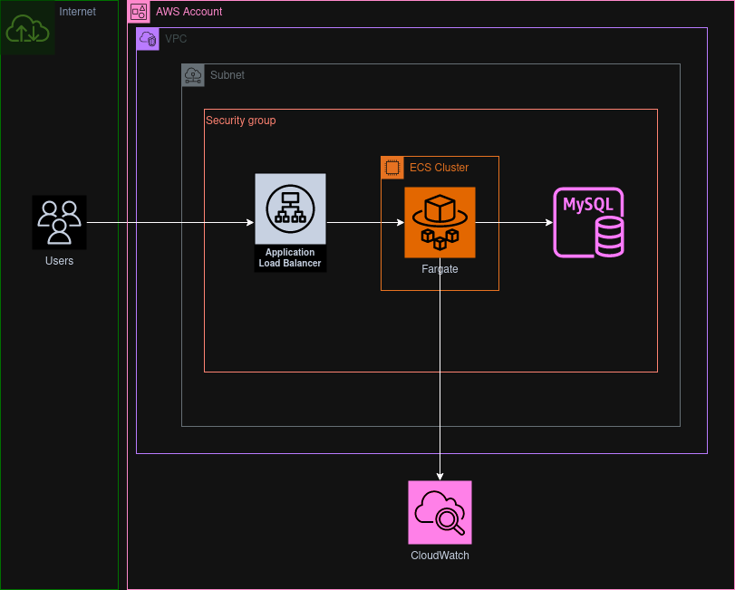

# AWS Wordpress ECS deployment with CDKTF
## Architecture

## Instructions
### This deployment requires the use of user Access Keys.
To deploy using deploy using Terraform Cloud, uncomment lines 4, 52-58 and 412-419 in main.ts and comment out line 407.

Comment out Config credentials in .github/workflows/deployment-workflow.yml

Add CDKTF_ECS_TFC_ORGANIZATION to the env block of CDKTF Deployment in .github/workflow/deployment-workflow.yml with the name of your organizatoin as the value.
### In the secrets and variables Actions menu, place the following key pairs
    1. AWS_ACCOUNT: <AWS_ACCOUNT>
    2. AWS_ROLE: <AWS_ROLE>
    3. STATE_BUCKET: <backend_bucket_to_store_state>

### Deploy Application:
    1. Navigate to the Actions tab
    2. Select Deployment Workflow on the left panel
    3. Select Run workflow
    4. Ensure the correct branch is selected
    6. Ensure deploy is selected in the drop down menu
    7. Run workflow

### Verify deployment by:
    1. Follow the deployment at the bmo-iac-cluster on the ECS page.
    2. Copy the DNS name from the loadbalancer page and visit the site in a new tab
    
### Destroy Application:
    1. Navigate to the Actions tab
    2. Select Deployment Workflow on the left panel
    3. Select Run workflow
    4. Ensure the correct branch is selected
    6. Ensure destroy is selected in the drop down menu
    7. Run workflow
